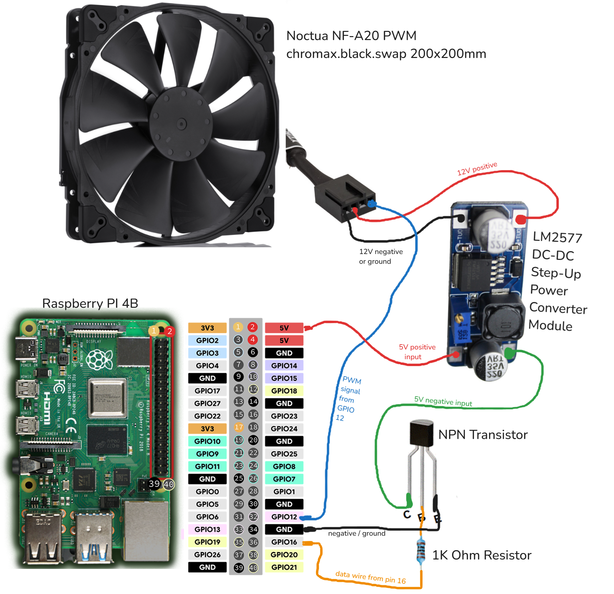
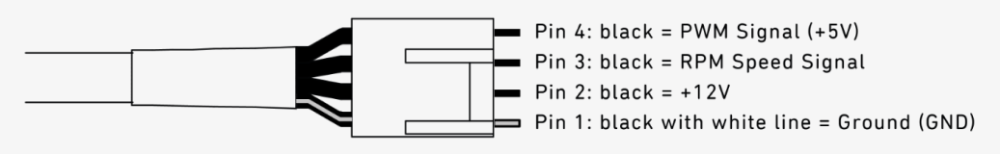

+++
date = '2024-11-18T00:14:52+02:00'
slug = 'cum-sa-controlezi-ventilator-noctua-din-raspberry-pi'
title = 'Cum să controlezi ventilatorul Noctua din Raspberry Pi'
description = 'Cum să controlezi un ventilator Noctua NF-A20 PWM din Raspberry Pi. De la oprit la viteze între 20%-100%'
featured_image = 'diagram.png'
images = ['diagram.png']
etichete = ['python', 'raspberry-pi', 'homelab', 'tutorial']
categorii = 'Raspberry Pi'
+++


Îmi construiesc [un homelab](/ro/posts/minipc-rack-partea-1/) și am nevoie să controlez ventilatorul [Noctua NF-A20 PWM chromax.black.swap 200x200mm](https://noctua.at/en/nf-a20-pwm-chromax-black-swap) folosind Raspberry Pi. Așa am reușit să fac asta.

## Componente necesare:

- Un Raspberry Pi
- Ventilatorul Noctua NF-A20 PWM (ar trebui să funcționeze la fel și cu alte ventilatoare de 12V)
- Un multimetru
- [Sursă Ridicătoare LM2577 DC-DC](https://www.optimusdigital.ro/ro/surse-ridicatoare-reglabile/12534-sursa-ridicatoare-lm2577-dc-dc.html)
- [Transistor NPN](https://www.optimusdigital.ro/ro/componente-electronice-tranzistoare/935-tranzistor-s9013-npn-50-pcs-set.html)
- Rezistență de 1K Ohm

## Diagramă:



## Să începem de la Pi:

1- Conectează un fir de la pin-ul GPIO 16, sau orice pin simplu, la rezistența de 1k, apoi conectează celălalt capăt la tranzistor pe pin-ul din mijloc.

2- Un fir de la pin-ul din dreapta al tranzistorului la orice pin Ground sau minus/negativ al Pi-ului. Fața tranzistorului este cea plată.

3- Un fir de la pin-ul din dreapta al tranzistorului la conectorul negativ/minus de 5V marcat "IN-" al sursei ridicătoare.

4- Un fir de la orice pin de 5V al Pi-ului (le găsești în parea de sus, dreapta) la conectorul pozitiv/plus de 5V marcat "IN+" al sursei ridicătoare.

5- **Important**: ajustează sursa la 12V sau mai puțin.
<br/>NU conecta ventilatorul acum pentru că îl poți arde instant dacă îl conectezi la o tensiune mai mare decat 12V.
<br/>&nbsp;&nbsp;&nbsp; A- Ca să pornești sursa ridicătoare temporar conectează un fir de la un pin ground/minus/negativ al Pi-ului direct la teminalul marcat "IN-" al sursei SAU poți executa codul python din urmatoarea secțiune. Trebuie doar să execuți `speed(fan, 100) / time.sleep(180)`.
<br/>&nbsp;&nbsp;&nbsp; B- Conectează multimetru la conectorii marcați "OUT+" și "OUT-" apoi selectează măsurarea voltajului la multimetru (de obicei marcat cu "2V").
<br/>&nbsp;&nbsp;&nbsp; C- Pe sursă învârte șurubul mic și galben de pe componenta albastră până când multimetrul arată 12V sau puțin mai mic, ca să fim siguri ca nu se strică. Eu l-am lăsat pe al meu la 11.5V.


&nbsp;&nbsp;&nbsp; D- Când ești gata deconectează multimetrul și firul conectat la ground, sau oprește programul python.

Am găsit schema pin-urilor ventilatorului Noctua aici:
https://faqs.noctua.at/en/support/solutions/articles/101000081757-what-pin-configuration-do-noctua-fans-use-


5- Un fir de la conectorul marcat "OUT-" (12V negativ) al sursei la pin-ul 1 al conectorului noctua.

6- Un fir de la conectorul marcat "OUT+" (12V pozitiv) al sursei la pin-ul 2 al conectorului noctua.

5- Un fir de la pin-ul 4 al conectorului noctua la pin-ul GPIO 12 al Pi-ului. [Acest pin are capabilitate PWM](https://pinout.xyz/pinout/pin32_gpio12/).

## Codul python:

Am folosit următorul cod din acest [tutorial publicat pe the-diy-life.com de Michael Klements](https://www.the-diy-life.com/connecting-a-pwm-fan-to-a-raspberry-pi/) ([cod sursă](https://github.com/mklements/PWMFanControl/blob/main/FanProportional.py)), și l-am modificat ca să folosească tranzistorul ca să oprească ventilatorul pentru că ventilatorul nu poate scădea viteza până la 0 RPM. [Viteza minimă de rotație este de 20%](https://noctua.at/en/nf-a20-pwm-chromax-black-swap/specification) (350RPM).

```python
#!/usr/bin/env python3
import RPi.GPIO as GPIO
import time
import signal
import sys

# Ventilatorul Noctua PWM are nevoie de 25 kHz (kilo!), vezi pagina 6 de pe:
# https://noctua.at/pub/media/wysiwyg/Noctua_PWM_specifications_white_paper.pdf
PWM_FREQ = 25           # [Hz] frecvență PWM
FAN_PIN = 12            # pin BCM pentru control ventilator PWM
TRAN_PIN = 16           # NPN Transistor

def speed(fan, percent):
    print("set fan to", percent)
    if (percent < 20):
        GPIO.output(TRAN_PIN, False)
        fan.ChangeDutyCycle(20)
    else:
        GPIO.output(TRAN_PIN, True)
        fan.ChangeDutyCycle(percent)

try:
    signal.signal(signal.SIGTERM, lambda *args: sys.exit(0))
    GPIO.setwarnings(True)
    GPIO.setmode(GPIO.BCM)
    GPIO.setup(TRAN_PIN, GPIO.OUT)
    GPIO.setup(FAN_PIN, GPIO.OUT, initial=GPIO.LOW)
    fan = GPIO.PWM(FAN_PIN, PWM_FREQ)

    # facem cateva cicluri pentru testare
    speed(fan, 100)
    time.sleep(30)

    speed(fan, 50)
    time.sleep(30)

    speed(fan, 0)
    time.sleep(30)

    speed(fan, 20)
    time.sleep(30)

    speed(fan, 70)
    time.sleep(30)

    speed(fan, 100)
    time.sleep(30)

except KeyboardInterrupt:
    pass

finally:
    GPIO.cleanup()
```

Finalizat!
