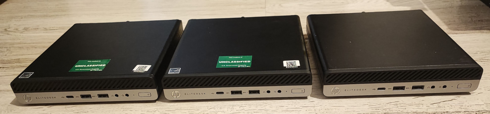
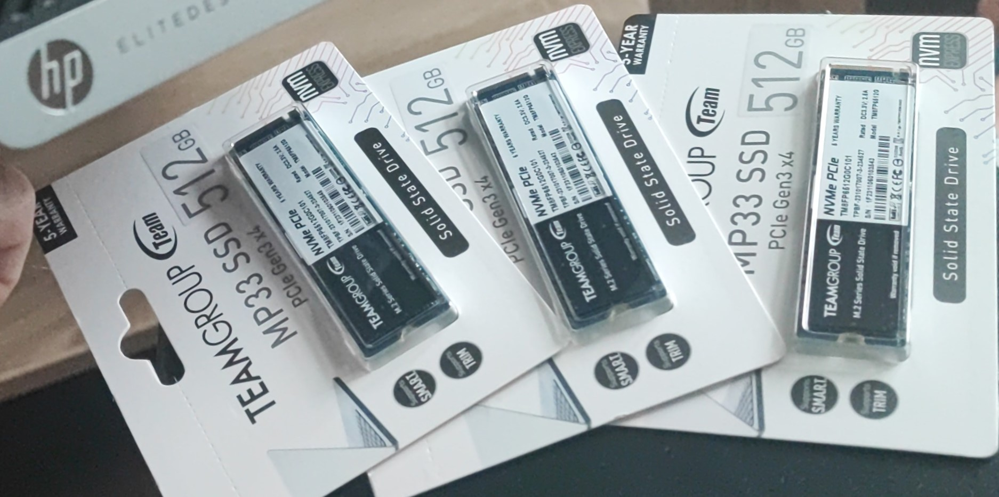
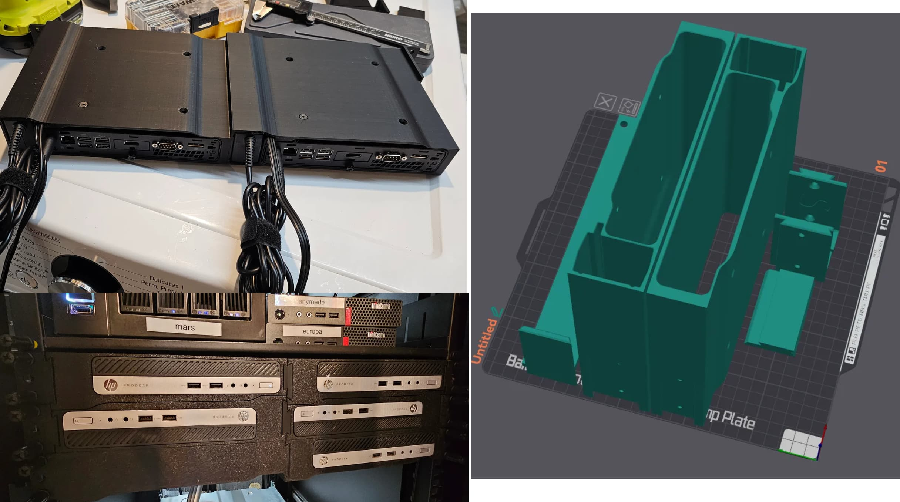
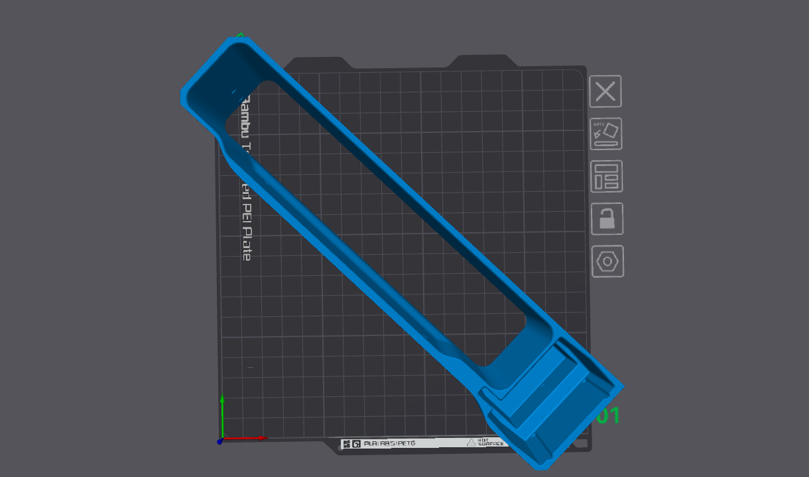

+++
date = '2024-11-19T00:16:30+00:00'
slug = 'minipc-rack-part-1'
title = 'MiniPC rack Part 1: the pc and case'
description = 'Getting the hardware for the MiniPC rack'
featured_image = 'minipcs-vertical.jpg'
tags = ['server', 'homelab', '3d-printing']
categories = '3D Print'
+++

## Hardware

I was looking start my homelab with a mini pc and I finally found a good deal on the second hand market:

HP EliteDesk 705 G4 with AMD Ryzen 5 2400GE, **16GB** RAM DDR4 2666 Mhz (sodimm/laptop), with 90W power supply for only **450 lei (~90€ / ~95$)**.

It offers a very good price to performance ratio because the CPU has **4 cores 8 threads at 3.8 GHz**. The CPU performance is the most important thing for me.
 I got one for testing, and then I get 2 more:

Then I found another deal for TeamGroup 512 GB NVMe M.2 SSD for only **120 lei (~24€ / ~25$)** (new/sealed).

**Perfect !**

## Software

I started researching for a good and free VM hypervisor, easy enough to configure and use.
 I tried out [Proxmox](https://www.proxmox.com/) but then I found [XCP-NG](https://xcp-ng.org/) with [XEN Orchestra](https://xen-orchestra.com/) on [Lawrence Systems's youtube channel](https://youtube.com/playlist?list=PLjGQNuuUzvmsrt8VrocFvN2DaZlwk8sgz&si=p8WJCt4I9TRDOrgO) and the search was over. It has multiple features that convinced me it is the best choice for me:

- Free and open source
- User interface easy and somewhat similar to VPS providers's interfaces
- Ability to replicate and migrate VMs on different hosts
- Snapshots

## 3D Printing the case

After a while I found a good deal on a 3D Printer and I started learning how to 3D print, mess around with settings, then I learned how to model basic small and simple parts.

I started searching around on [yeggi.com](https://www.yeggi.com/) (search engine for 3D models) for compatible cases for this MiniPC and I found the best one:

[HP Mini Staggered Rack Mount by @dsluo_362876](https://www.printables.com/model/827617-hp-mini-staggered-rack-mount)

The idea is great: incorporate the MiniPC and it's power supply in the same case. The execution is great ! The model is very good quality.

One problem: My 3D printer BambuLab A1 Mini has a small bed size at 180x180x180 mm and I have to rotate the model at 45 degrees, and cut the very thick top part of the case.

**Problem solved** ! It fits perfectly in the bed ! It's print time !

I stopped the print after 2-3 cm just to make some fitment checks make sure I dont print the whole thing for nothing it it does not fit.
 This is a very **good practice** and I recommend you do the same !
 Good thing I did this because I found out that **the power supply I have is bigger in every dimension** than the one the author had. He wrote the power supply dimensions in the model description but I did not read it.

I'm stuck! I need to modify the model to fit my power supply but I don't know how to do it and I don't have the source files, I only have the STL mesh file.

**To be continued...** check part 2
