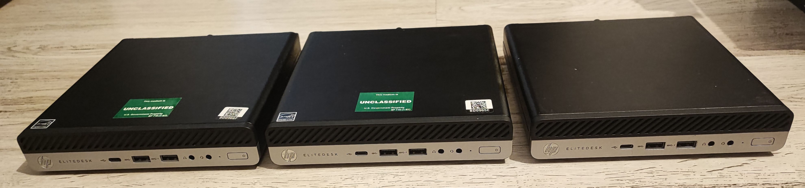

+++
date = '2024-11-19T00:16:30+00:00'
slug = 'minipc-rack-partea-1'
title = 'MiniPC rack Partea 1: pc și carcasă'
description = 'Am cumpărat hardware-ul pentru MiniPC rack'
featured_image = 'minipcs-vertical.jpg'
images = ['minipcs-vertical.jpg']
etichete = ['server', 'homelab', '3d-printing']
categorii = '3D Print'
+++

## Hardware

Căutam să încep un homelab cu un mini pc și în sfârșit am găsit o oferta bună second hand:

HP EliteDesk 705 G4 cu AMD Ryzen 5 2400GE, **16GB** RAM DDR4 2666 Mhz (sodimm/laptop), cu sursă de 90W pentru doar **450 lei (~90€ / ~95$)**.

Oferă un balanț bun între preț și performanță pentru că procesorul are **4 nuclee 8 thread-uri la 3.8 GHz**. Performanța procesorului este cel mai important lucru pentru mine.
 Am cumpărat unu ca să îl testez, apoi am cumpărat încă 2:

Apoi am găsit altă ofertă pentru SSD TeamGroup 512 GB M.2 NVMe pentru doar **120 lei (~24€ / ~25$)** (nou/sigilat).

**Perfect !**

## Software

Am început să caut un hypervisor bun, gratuit și ușor de configurare și de folosit.
 Am încercat [Proxmox](https://www.proxmox.com/) dar apoi am găsit [XCP-NG](https://xcp-ng.org/) cu [XEN Orchestra](https://xen-orchestra.com/) pe canalul de youtube [Lawrence Systems](https://youtube.com/playlist?list=PLjGQNuuUzvmsrt8VrocFvN2DaZlwk8sgz&si=p8WJCt4I9TRDOrgO) și căutarea s-a încheiat. Are multe funcții care m-au convins că este cea mai bună alegere pentru mine:

- Gratis și open source
- Interfață ușor de folosit și oarecum similară cu interfața altor provideri de VPS
- Funcția de replicare și migrare a unui VM pe alt host
- Snapshot-uri

## Carcasă printată 3D

După ceva timp am găsit o ofertă bună pentru o imprimantă 3D și am început să învăț cum să printez, optimizez setări, apoi am învățat cum să modelez câteva componente simple.

Am început să caut pe [yeggi.com](https://www.yeggi.com/) (motor de căutare pentru modele 3D) pentru modele de carcase compatibile cu modelul meu și l-am găsit pe cel mai bun:

["HP Mini Staggered Rack Mount" de @dsluo_362876](https://www.printables.com/model/827617-hp-mini-staggered-rack-mount)

Idea e perfectă: încorporează MiniPC-ul și sursa lui în aceeași carcasă compactă. Execuția e perfectă ! Modelul este foarte bine gândit.

O singură problemă: Imprimanta mea BambuLab A1 Mini are o dimensiune mică de printare de 180x180x180 mm și a trebuit să rotesc modelul la 45 de grade și să șterg partea groasă de sus a casei.

**Problemă rezolvată** ! Încape la milimetru pe imprimantă ! Să dăm drumul la printare !

Am oprit printarea după 2-3 cm ca să verific că se potriveste bine modelul și să nu îl printez degeaba dacă nu se potrivește.
 Este o practică **foarte bună** și îți recomand să faci la fel !
 Bine că l-am oprit să verific că mi-am dat seama că **sursa mea este mai mare** decât cea a autorului în toate dimensiunile. Autorul a scris dimensiunile sursei în descrierea modelului dar nu am citit.

Acum sunt blocat. Trebuie să modific modelul ca să încapă sursa mea de 90W dar nu știu cum să îl modific și nu am fișierele sursă, am doar fișierele STL mesh.

**Va urma...** citește partea 2

