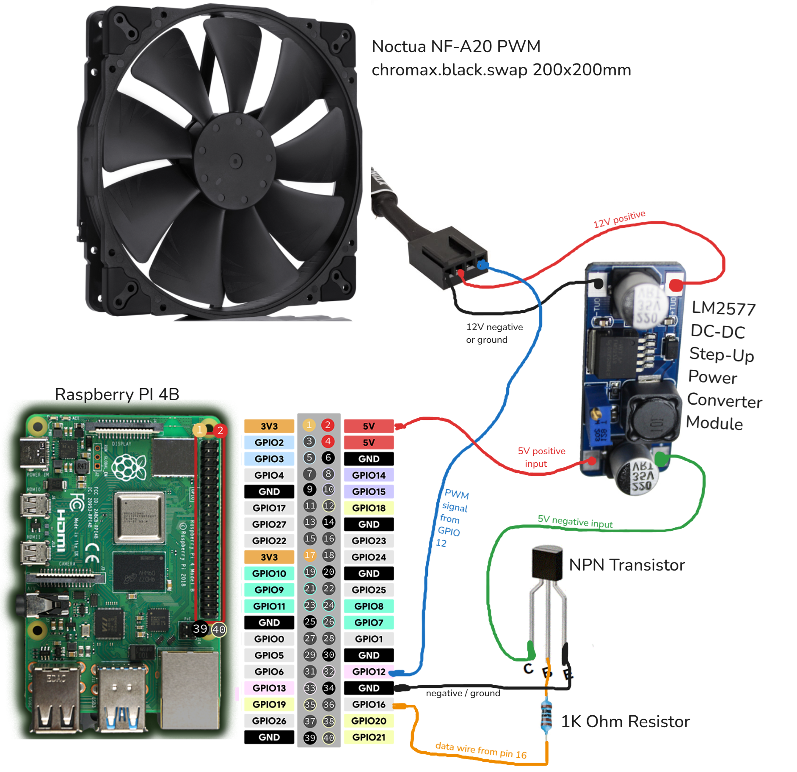

+++
date = '2024-11-18T00:18:52+02:00'
title = 'How to control a Noctua PWM fan from Raspberry Pi'
description = 'How to control a Noctua NF-A20 PWM fan from Raspberry Pi. From OFF to 20%-100% speed'
# featured_image = ''
tags = ['python', 'raspberry-pi', 'homelab', 'tutorial']
categories = 'Raspberry Pi'
+++


I am making my homelab and I need to control the [Noctua NF-A20 PWM chromax.black.swap 200x200mm](https://noctua.at/en/nf-a20-pwm-chromax-black-swap) fan from Raspberry Pi, and this is how I've done it.

## Parts you need:

- Some Raspberry Pi
- The Noctua fan (should work with other 12V noctua fans as well)
- A multimeter
- [LM2577 DC-DC Step Up Booster Converter](https://www.amazon.com/Adjustable-Converter-Transformer-Regulator-3-5V-35V/dp/B092CJBL92)
- [NPN Transistor](https://www.amazon.com/ALLECIN-2N2222-Amplifier-Transistors-Transistor/dp/B0CBK1T5FQ)
- 1K Ohm Resistor

## Diagram:



## Let's start from the Pi:

1- Connect a wire from GPIO pin 16, or any simple gpio pin, to the 1k resistor, and then the other end of the transistor to the middle pin of the transistor.

2- A wire from the right pin of the transistor to any ground pin of the Pi. The face of the transistor is the flat one.

3- A wire from the left pin of the transistor to the "IN-" 5V negative input of the power convertor.

4- A wire from one of the 5V Pi pins (top right) to the "IN+" 5V positive input of the power convertor.

5- **Important**: adjust the converter to 12V or lower.
Do NOT connect the fan right now because you can permanently damage it because of high voltage.
&nbsp;&nbsp;&nbsp; A- Turn on the converter by connecting a ground pin from the Pi directly to the Power Converter's "IN-" connector OR by runing the code from the next section and just calling `speed(fan, 100) / time.sleep(180)`.
&nbsp;&nbsp;&nbsp; B- Connect a multimeter to the converter's "OUT+" and "OUT-" and select voltage.
&nbsp;&nbsp;&nbsp; C- Turn the small yellow screw until the multimeter shows 12V or a bit smaller to be safe. I have mine at 11.5V.


&nbsp;&nbsp;&nbsp; D- When you are done disconnect the multimeter and the ground wire, or turn off the script.

The pinout from the noctua fan I found here: 
https://faqs.noctua.at/en/support/solutions/articles/101000081757-what-pin-configuration-do-noctua-fans-use-


5- Wire from power convertor "OUT-" (12V negative) to noctua pin 1

6- Wire from power convertor "OUT+" (12V positive) to noctua pin 2

5- Wire from noctua pin 4 to Pi GPIO pin 12. [This pin has PWM capability](https://pinout.xyz/pinout/pin32_gpio12/).

## The code:

I used the code from this [tutorial published on the-diy-life.com by Michael Klements](https://www.the-diy-life.com/connecting-a-pwm-fan-to-a-raspberry-pi/) ([original code](https://github.com/mklements/PWMFanControl/blob/main/FanProportional.py)), and I modified it to use the transistor to turn off the fan, because the fan PWM does not scale down to 0 RPM. The [minimum rotational speed is 20%](https://noctua.at/en/nf-a20-pwm-chromax-black-swap/specification) (350RPM).

```python
#!/usr/bin/env python3
import RPi.GPIO as GPIO
import time
import signal
import sys

# The Noctua PWM control actually wants 25 kHz (kilo!), see page 6 on:
# https://noctua.at/pub/media/wysiwyg/Noctua_PWM_specifications_white_paper.pdf
PWM_FREQ = 25           # [Hz] PWM frequency
FAN_PIN = 12            # BCM pin used to drive PWM fan
TRAN_PIN = 16           # NPN Transistor

def speed(fan, percent):
    print("set fan to", percent)
    if (percent < 20):
        GPIO.output(TRAN_PIN, False)
        fan.ChangeDutyCycle(20)
    else:
        GPIO.output(TRAN_PIN, True)
        fan.ChangeDutyCycle(percent)

try:
    signal.signal(signal.SIGTERM, lambda *args: sys.exit(0))
    GPIO.setwarnings(True)
    GPIO.setmode(GPIO.BCM)
    GPIO.setup(TRAN_PIN, GPIO.OUT)
    GPIO.setup(FAN_PIN, GPIO.OUT, initial=GPIO.LOW)
    fan = GPIO.PWM(FAN_PIN, PWM_FREQ)

    # do a few cycles just for testing
    speed(fan, 100)
    time.sleep(30)

    speed(fan, 50)
    time.sleep(30)

    speed(fan, 0)
    time.sleep(30)

    speed(fan, 20)
    time.sleep(30)

    speed(fan, 70)
    time.sleep(30)

    speed(fan, 100)
    time.sleep(30)

except KeyboardInterrupt:
    pass

finally:
    GPIO.cleanup()
```

Done. Happy tinkering !
